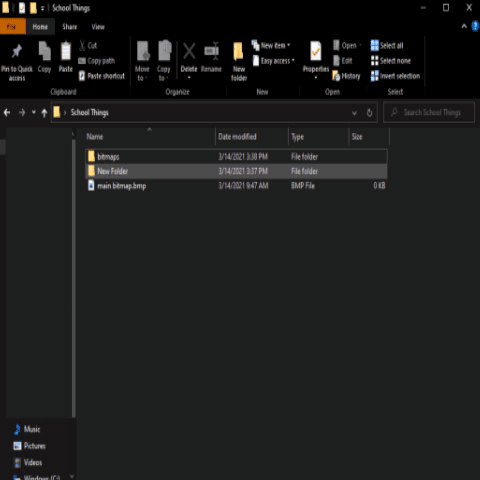

  

<h1 align="center">autosort</h1>
<h4 align="center">A lightweight file-copying interface.</h4>

<a>

## Preview  

  

## Installation

Download the latest version of autosort from https://github.com/vihdutta/autosort/releases. Since autosort is an .exe, your anti-virus may prevent you from running autosort. Implementations to avoid this are being worked on.

## Usage

Select the source directory (files you want to copy) and the destination directory (where you want to copy to) which appears on button press. Note: the source directory selects all files inside that directory. Click the run button to start the copying process.